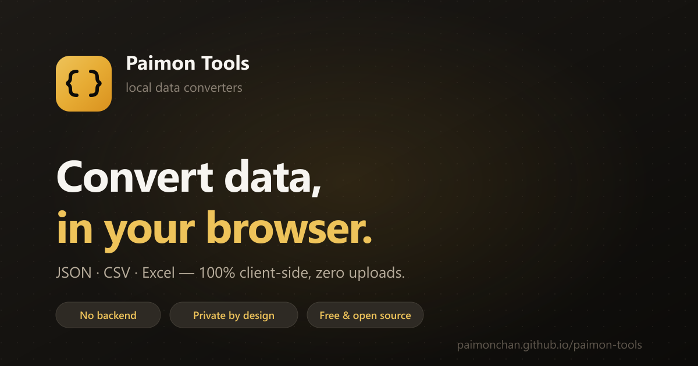

<div align="center">



# Paimon Tools

### Private, in-browser tools for data & code — nothing ever leaves your device.

[**▶ Open the app →**](https://paimonchan.github.io/paimon-tools/)
&nbsp;&nbsp;·&nbsp;&nbsp;
[**💻 Code Playground →**](https://paimonchan.github.io/paimon-tools/code/)
&nbsp;&nbsp;·&nbsp;&nbsp;
[Tools](#tools)&nbsp;&nbsp;·&nbsp;&nbsp;[Features](#features)&nbsp;&nbsp;·&nbsp;&nbsp;[Self-host](#deploy-it-yourself)

[](https://paimonchan.github.io/paimon-tools/)
[](https://github.com/paimonchan/paimon-tools/actions)
[](LICENSE)

[](https://www.typescriptlang.org/)
[](https://react.dev/)
[](https://vite.dev/)
[](https://tailwindcss.com/)
[](https://github.com/pmndrs/zustand)
[](#contributing)

</div>

---

> **No backend. No uploads. No tracking.**
> Every tool runs entirely in your browser — paste your data, run your code,
> and nothing ever touches a server. That's not a feature, it's the whole point.

## Why use this?

Most online converters and code-runners send your data to a server you don't
control. If you're converting a config file with secrets, a customer list, or
running a script — **that's a problem**.

Paimon Tools ships the entire engine to your browser. Data is processed locally
and discarded when you close the tab.

- **Private by design** — zero network requests during conversion
- **Instant** — no upload/download round-trip
- **Works offline** — once loaded, it needs no connection
- **Free & open source** — audit the code yourself

## Tools

**17 tools** across three categories, plus a multi-language code playground.

### Convert

| Tool | What it does |
|------|--------------|
| [JSON → CSV](https://paimonchan.github.io/paimon-tools/json-to-csv/) | JSON array to CSV table (and back) |
| [JSON → Excel](https://paimonchan.github.io/paimon-tools/json-to-excel/) | JSON to downloadable `.xlsx` (and back) |
| [CSV → Excel](https://paimonchan.github.io/paimon-tools/csv-to-excel/) | CSV to `.xlsx` (and back) |
| [YAML → JSON](https://paimonchan.github.io/paimon-tools/yaml-to-json/) | YAML ↔ JSON conversion |
| [Base64 Encode](https://paimonchan.github.io/paimon-tools/base64-encode/) | Text ↔ Base64 (UTF-8 safe, emoji-friendly) |

### Format

| Tool | What it does |
|------|--------------|
| [JSON Formatter](https://paimonchan.github.io/paimon-tools/json-formatter/) | Validate & pretty-print (2/4 spaces or tab) |
| [JSON Minifier](https://paimonchan.github.io/paimon-tools/json-minifier/) | Strip whitespace, validate syntax |

Both JSON tools support **Lenient mode** (JSON5) — single quotes, trailing
commas, and comments are accepted.

### Tools

| Tool | What it does |
|------|--------------|
| [SHA-256 Hash](https://paimonchan.github.io/paimon-tools/hash-generator/) | Generate a SHA-256 digest of any text |
| [UUID Generator](https://paimonchan.github.io/paimon-tools/uuid-generator/) | Create one or many UUID v4 identifiers |
| [Combine Files](https://paimonchan.github.io/paimon-tools/combine-files/) | Merge multiple CSV/Excel files into one (append rows, union columns) |
| [Diff Tool](https://paimonchan.github.io/paimon-tools/diff-tool/) | Compare two texts side-by-side with color-coded changes |
| [Code Playground](https://paimonchan.github.io/paimon-tools/code/) | Run JS / TypeScript / Python / HTML in a sandboxed worker + iframe |

### Code Playground

A browser-native REPL with no backend:

- **JavaScript & TypeScript** — run via a Web Worker sandbox, with an in-browser
  ESM bundler (esbuild-wasm) so `import` works
- **Python** — executed via Pyodide (WebAssembly CPython, lazy-loaded from CDN)
- **HTML** — live preview in a sandboxed iframe (`allow-scripts`, no origin)
- **Share via URL** — code is compressed (lz-string) into the URL hash
- **CodeMirror 6** editor with per-language syntax highlighting

## Features

- **Command palette** (`⌘K` / `Ctrl K`) to jump between tools
- **Resizable split panes** — input and output side by side
- **Live conversion** as you type, with timing stats
- **Keyboard shortcuts** — `⌘S` download · `⌘⇧S` swap · `⌘⇧C` copy
- **Persistent state** — your work survives a reload
- **Dark & light themes** — defaults to dark
- **Drag & drop** file uploads, with sample data baked into every tool
- **Per-tool deep links** — every tool has a clean, crawlable URL (`/json-to-csv/`, etc.)
- **SEO-ready** — JSON-LD structured data + prerendered static HTML per page
- **Fully typed** — TypeScript throughout, zero `any`
- **Code-split bundles** — heavy deps (SheetJS, CodeMirror, Pyodide) load on demand

## Project structure

```
src/
├── engine/                    Pure conversion logic (zero React, zero DOM)
│   ├── converters/
│   │   ├── json-io.ts         JSON parse / format / minify
│   │   ├── csv-io.ts          CSV ↔ JSON
│   │   ├── xlsx-io.ts         Excel read/write (SheetJS)
│   │   ├── yaml-io.ts         YAML ↔ JSON
│   │   ├── base64-io.ts       Base64 encode/decode
│   │   ├── hash-gen.ts        SHA-256 (pure JS)
│   │   ├── uuid-gen.ts        UUID v4
│   │   ├── excel-merge.ts     Combine-files engine
│   │   └── diff-engine.ts     Line diff engine
│   ├── registry.ts            Tool definitions (config-driven, discriminated union)
│   └── result.ts              Result<T> = Ok<T> | Err
├── playground/                Code playground (lazy-loaded route)
│   ├── PlaygroundTool.tsx     Orchestrator
│   ├── engines/
│   │   ├── worker-engine.ts   JS/TS execution via Web Worker + timeout
│   │   ├── bundler-engine.ts  ESM bundling via esbuild-wasm
│   │   ├── pyodide-engine.ts  Python via Pyodide WASM
│   │   └── html-engine.ts     HTML preview engine
│   └── worker/sandbox-worker.ts   Isolated execution worker
├── components/                React UI (one default export per file)
│   ├── ConversionTool.tsx     Generic converter workspace
│   ├── PlaygroundTool / DiffTool / CombineFilesTool   Custom tool UIs
│   ├── Panes / Sidebar / CommandPalette / …           Shared chrome
├── stores/                    Zustand state (theme + toast)
├── hooks/usePersistentState.ts   localStorage-backed state
├── lib/                       Browser I/O + adapters (no JSX)
│   ├── files.ts / router.ts / makeFilename.ts / icon-map.ts
│   ├── playground-share.ts    URL share via lz-string
│   └── seo.js                 Per-tool SEO metadata (plain JS, used by prerender)
├── App.tsx                    Root shell + routing
└── main.tsx                   Entry point
```

See [`AGENTS.md`](AGENTS.md) for the full layer rules and conventions.

## Deploy it yourself

The build is a fully static site — host it anywhere.

```bash
git clone https://github.com/paimonchan/paimon-tools.git
cd paimon-tools
npm install
npm run build     # → ./dist
```

Then serve the `dist/` folder from any static host (GitHub Pages, Netlify,
Vercel, Cloudflare Pages, or even `python -m http.server`).

### GitHub Pages (one-push deploy)

This repo includes a [deploy workflow](.github/workflows/deploy.yml) that builds
and publishes on every push to `main`. Enable **Settings → Pages → Source:
GitHub Actions** to activate it. The [prerender script](scripts/prerender.mjs)
generates a static HTML page per tool route and the sitemap automatically.

## Adding a tool

### Converter

The engine is pure functions and the UI is config-driven. To add a converter:

1. Write a **converter function** in `engine/converters/` (pure, typed, returns `Result<T>`)
2. Add a **registry entry** in `engine/registry.ts` with `type: 'converter'`

The sidebar, command palette, URL routing, SEO, and keyboard shortcuts pick it
up automatically — no UI changes.

### Non-converter tool (Playground, Diff, …)

1. Add a registry entry with `type: 'ref'`
2. Create a lazy-loaded component with `React.lazy()`
3. Route it in `App.tsx`

## Built with

- **[TypeScript 7](https://www.typescriptlang.org/)** — fully typed
- **[React 19](https://react.dev/)** + **[Vite 8](https://vite.dev/)** (Rolldown)
- **[Zustand 5](https://github.com/pmndrs/zustand)** — state management
- **[Tailwind CSS 4](https://tailwindcss.com/)** — `@theme` tokens, `@import` syntax
- **[PapaParse](https://www.papaparse.com/)** — CSV
- **[SheetJS](https://docs.sheetjs.com/)** — Excel
- **[js-yaml](https://github.com/nodeca/js-yaml)** — YAML
- **[JSON5](https://json5.org/)** — lenient JSON
- **[diff](https://github.com/kpdecker/jsdiff)** — line diffing
- **[CodeMirror 6](https://codemirror.net/)** — playground editor
- **[esbuild-wasm](https://esbuild.github.io/)** — in-browser ESM bundler
- **[lz-string](https://github.com/pieroxy/lz-string)** — URL share compression

## Contributing

PRs welcome. The codebase is structured so most changes are local — touching a
converter never involves the UI, and vice versa. See [`AGENTS.md`](AGENTS.md)
for conventions.

## License

MIT — do whatever you want.
